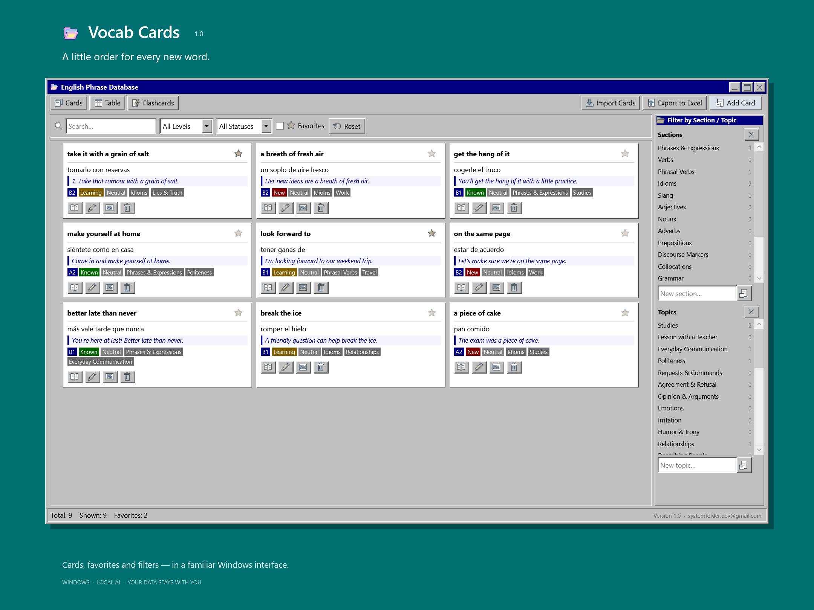
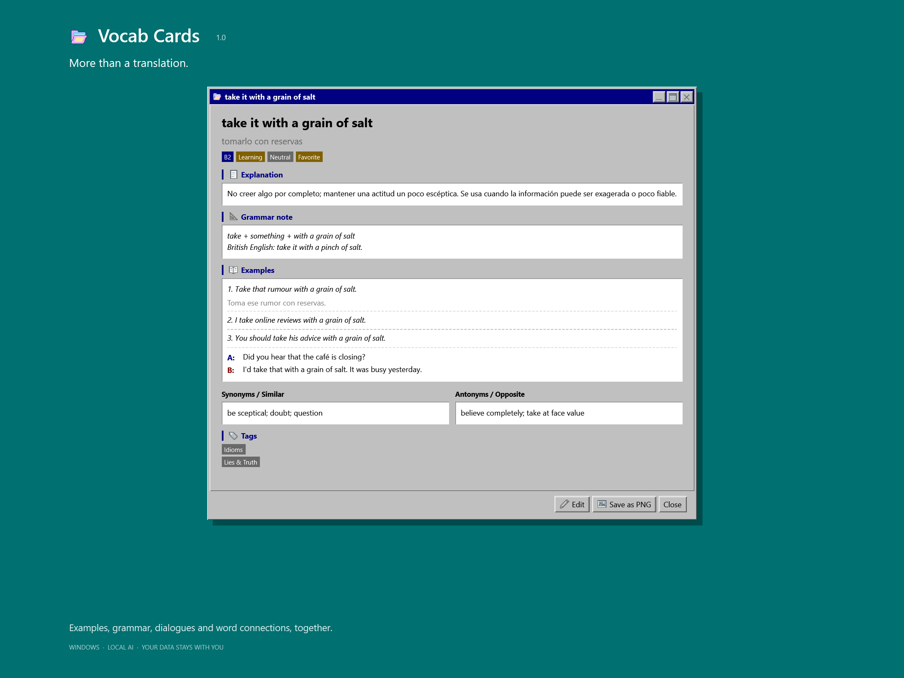
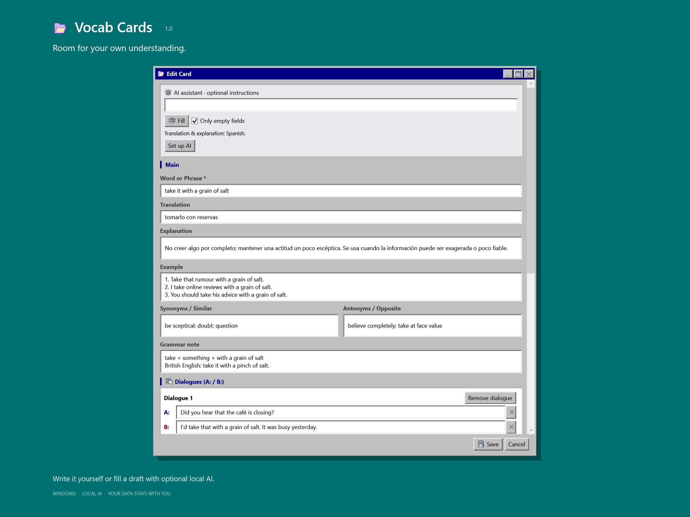
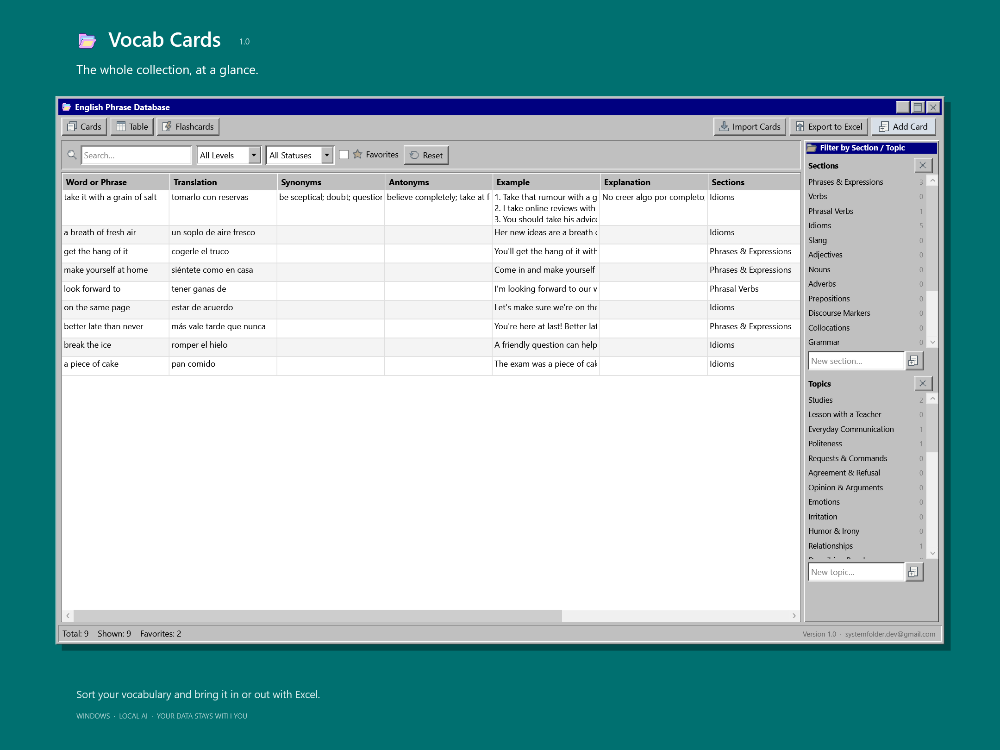
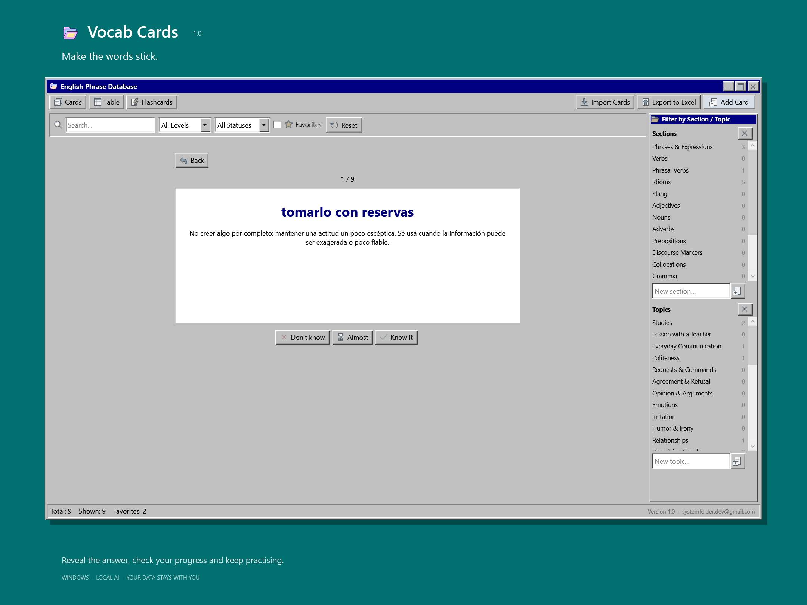

# Vocabulary Cards

A native Windows vocabulary application with a classic Windows interface. Version **1.0** uses C# and WPF and opens in its own window.



## Installation

1. Download [English-Vocab-DB-Setup.exe](https://github.com/RitaBarbarita/vocab-cards/raw/refs/heads/main/English-Vocab-DB-Setup.exe).
2. Close the previous version, run the installer and choose the language for translations and explanations.

The interface stays in English. The installer is unsigned, so Windows SmartScreen may display a warning.

## Features

- Vocabulary cards with translations, explanations, examples, grammar notes, synonyms, antonyms and dialogues.
- Levels, learning statuses, registers, sections, topics and favorites.
- Search, filters, a sortable table and flashcard practice.
- Excel `.xlsx` and `.xls`, CSV and pasted-table import with column matching and duplicate detection; Excel export.
- Image attachments and individual card export as PNG.
- Optional local AI filling with Stop, Undo and a mode that fills only empty fields. Review generated text before saving.
- Centered card rows, incremental loading that keeps your scroll position, and a Back to top button.

## Screenshots

<table>
<tr>
<td width="50%"><strong>Card details</strong><br></td>
<td width="50%"><strong>Card editor and local AI</strong><br></td>
</tr>
<tr>
<td width="50%"><strong>Vocabulary table</strong><br></td>
<td width="50%"><strong>Flashcard practice</strong><br></td>
</tr>
</table>

The screenshots show the actual application with fictional demonstration cards and Spanish translations. These cards are not installed with the application.

## Local AI

No API key or paid subscription is required. Use **Set up AI** inside the application to install the local Ollama runtime and Qwen3.5 9B model. Initial setup requires an internet connection, downloads about **8.1 GB**, and needs about **15 GB** of free disk space. The runtime and model are downloaded separately from the small application installer.

After setup, card generation runs locally. Speed depends on the computer's memory and GPU. Manual cards and study features work without AI.

## Requirements

- Windows 10 or Windows 11, 64-bit.
- .NET Framework 4.8.

The main interface has no browser or WebView dependency. Microsoft Edge is used only for a one-time transfer from an existing older browser-based installation. This installer is for Windows, not iOS or macOS.

## Privacy and data

The installer does **not** contain the author's personal vocabulary database or attachments. A new installation starts with an empty database unless this computer already has data from a previous version.

Cards and images are stored locally in `%LOCALAPPDATA%\English Vocab DB\NativeData`. Updating the application preserves this data. Uninstalling retains the vocabulary and local AI files. Downloads are needed for initial AI setup; card text is processed by the local model.

## Updating

Close the application and run the new installer over the existing version. Existing cards, images and local AI files are preserved. Older browser-based data is transferred on first launch, while the original profile is retained.

Version **1.0** fixes maximized window bounds above the taskbar, title-bar spacing and buttons, metadata dropdowns, centered card rows and loading scroll position. It restores white category panels, the dark red New tag and dashed example separators, and includes Back to top.

## Source and build

Source code, icons and build instructions are in [`native`](./native). On Windows, run:

```powershell
powershell -NoProfile -ExecutionPolicy Bypass -File native\build.ps1
```

No packages are downloaded during the build. The generated installer is written to `outputs\English-Vocab-DB-Native-Setup-1.0.exe`. The root download keeps its original filename for compatibility.

The packaged version passed 38 application checks, 48 UI regression checks and seven isolated upgrade checks. See [`native/RELEASE.md`](./native/RELEASE.md) for details.

## Contact

Questions, feedback or bug reports: [systemfolder.dev@gmail.com](mailto:systemfolder.dev@gmail.com).
